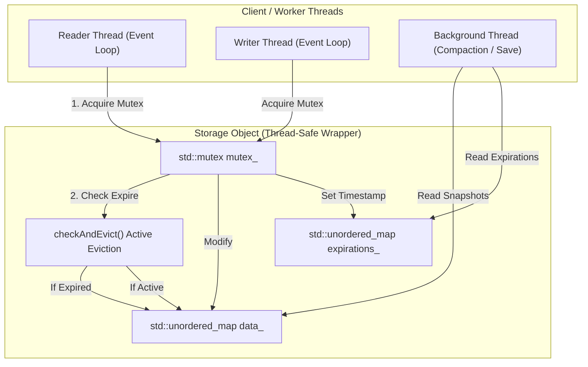
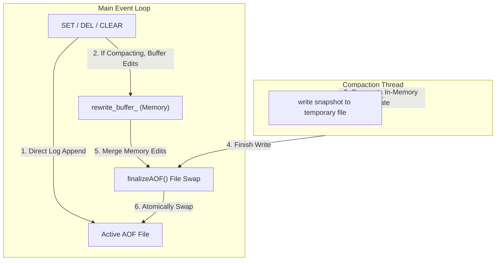
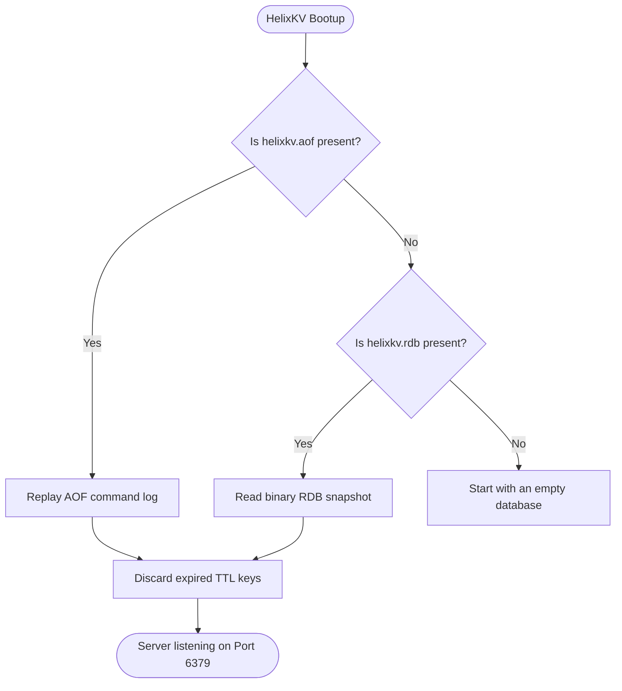

# HelixKV v1.0 Architecture Design

This document details the high-level architecture of HelixKV, illustrating key components and the lifecycle of data operations through structured diagrams.

---

## 1. Request Lifecycle & Networking Layer
HelixKV utilizes a single-threaded event-driven network architecture built around the OS-level `select()` multiplexer. It operates in a non-blocking mode to support concurrent client multiplexing without the thread overhead of typical thread-per-connection servers.

```mermaid
sequenceDiagram
    autonumber
    actor Client as Client / redis-cli
    participant Socket as TCP Socket (Port 6379)
    participant Loop as Event Loop (select)
    participant Session as Client Session Buffer
    participant Parser as RESP Parser
    participant Handler as Command Handler
    participant Storage as In-Memory Storage

    Client->>Socket: Send Command Payload (RESP or Inline)
    Loop->>Socket: Socket is readable
    Loop->>Session: Append read bytes to buffer
    Loop->>Parser: Inspect stream start character
    alt Starts with '*' (RESP)
        Parser->>Parser: Parse RESP multi-bulk array
    else Starts with standard text (Inline)
        Parser->>Parser: Delimit by newline (\n)
    end
    Parser->>Handler: Dispatch parsed string vector (parts)
    Handler->>Storage: Perform read/write operations
    Storage-->>Handler: Return results
    Handler->>Parser: Format response (RESP or inline simple text)
    Parser->>Socket: Write formatted bytes to socket
    Socket-->>Client: Receive reply payload
```

---

## 2. Storage Layer & Concurrency Model
The database storage engine resides entirely in memory. It uses standard hash maps protected by a lock interface to coordinate access during background operations.



---

## 3. Persistence Flow (AOF & RDB)
HelixKV supports two persistence engines: **Append Only File (AOF)** for durability, and **Snapshotting (RDB)** for point-in-time recovery. 

### AOF Logging & Compaction Lifecycle
Compaction runs asynchronously in a worker thread. Writes during compaction are accumulated in a memory buffer and merged during finalization to prevent database writes from blocking client requests.



---

## 4. Startup Recovery Flow
When HelixKV starts up, it recovers the state of the database by executing a hybrid recovery logic:


